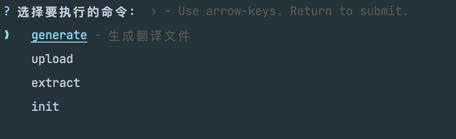
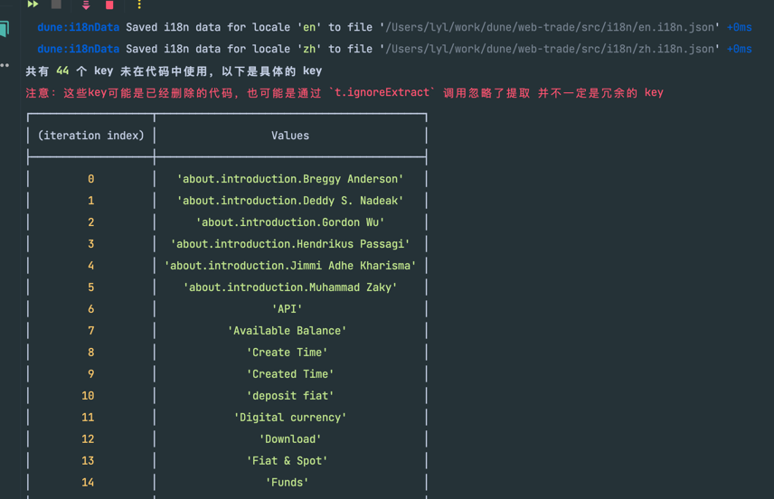
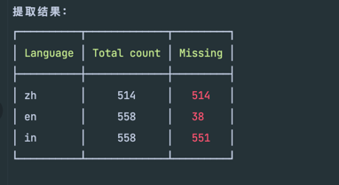

## cli

- 提取翻译文案到`json`文件, 运行 `dune extract`
- 同步文件到`google sheet`(必须要有配置文件), 运行 `dune sync`
- 从`google sheet`生成文件(必须要有配置文件), 运行 `dune generate`
- 从`swagger` 生成`api`请求文件, 运行 `dune generateApi`
- 初始化配置文件, 运行 `dune init`

## 支持的命令

```shell
Commands:
  download     生成翻译文件
  extract      提取代码中的文案
  upload       上传翻译文件
  generateApi  生成api文件
  init         初始化配置文件
  interactive  交互式操作
```

## 交互式选择

运行`dune` 或者 `dune interactive`，会进入交互式选择，上下键选择要执行的命令，回车键确认。



## 显示未使用的 keys



## 提取成功后的统计


